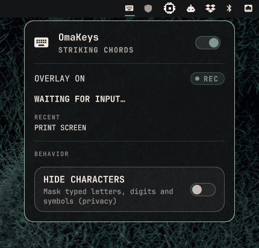

# OmaKeys - Omarchy plugin



A floating on-screen overlay that shows the keys you press and the mouse
buttons you click, plus a small indicator in the Omarchy bar. Built for
screencasts, live demos, teaching, and accessibility use cases.

### Overlay demo

<p align="center">

https://github.com/user-attachments/assets/706e3535-3bbf-4c08-8825-b30495120a58

</p>

## Features

- Per-monitor floating overlay showing the current key combo (modifiers first).
- Mouse buttons (LMB/RMB/MMB/side/back/forward) and scroll direction.
- Recent-combo history in the panel, always showing the live "now holding" combo.
- Bar widget with a REC indicator and a click-through settings panel.
- Privacy mode: masks typed letters, digits and symbols (`hideCharacters`).
- No root at runtime, works without re-login (setgid input), no daemonize.

## How it works

Omarchy runs on Wayland, which gives userland programs no way to capture keys
globally. The plugin therefore ships a small **Rust daemon** that reads
`/dev/input/event*` directly through **evdev** and mirrors the current combo
into a JSON file. Qt Quick (Quickshell) watches that file with a `FileView`
and renders the overlay.

```
                    ┌─────────────────────────────────────┐
  /dev/input/event* │  omakeys-daemon (Rust, evdev)       │
  ──(read)────────► │  decode → snapshot → write JSON     │
                    │  relayout via libxkbcommon          │
                    └───────────────┬─────────────────────┘
                                    │
                                    ▼
    ~/.local/state/omarchy/current/plugins/skvggor.omakeys/keys.json
                                    │ FileView watch
                                    ▼
        Service.qml → BarWidget.qml (indicator) → Overlay.qml (UI)
```

- `bin/omakeys-daemon`: the evdev reader (Rust, `src/`).
- `Service.qml`: owns the daemon lifecycle and parses the state file.
- `BarWidget.qml`: bar indicator with live status and a click-through panel.
- `Overlay.qml`: per-monitor floating overlay.
- `Model.js`: pure display helpers shared between QML and Node tests.

The daemon resolves keys to characters/names with `libxkbcommon`, using the
layout from `hyprctl getoption input:kb_layout` (or `--layout/--variant/--options`).

### Why `setgid input`?

Reading `/dev/input/event*` requires membership in the `input` group, which
normally takes effect only at the next login. To avoid forcing a re-login the
install helper marks the daemon binary **setgid `input`**, so every time it
runs it gets group `input` privileges even though your session was started
before that group existed.

The daemon itself still runs as your user; only the group bit is elevated,
and it never runs as root.

## Requirements

- Omarchy shell (Hyprland + Quickshell).
- `curl` and `jq` (used by the installer to fetch and verify the prebuilt daemon).
- `libxkbcommon` at runtime (usually already present).
- `hyprctl` reachable on `PATH` (used to discover the active keyboard layout).
- Rust toolchain is **not** required for installation; it is only needed for
  developers who build the daemon locally.

## Install

Add the plugin and restart the shell:

```sh
omarchy plugin add git@github.com:skvggor/omakeys-omarchy-plugin.git --enable --yes
omarchy restart shell
```

The installer downloads the **prebuilt daemon from the latest GitHub release**,
verifies its published SHA-256 and its **Sigstore build attestation**
(GitHub-signed proof that the binary was built by this repository's Actions), so
you never compile anything and never run a tampered binary:

```sh
cd "$HOME/.config/omarchy/plugins/skvggor.omakeys"
./bin/omarchy-install-omakeys --install   # downloads release daemon + setgid input (one sudo prompt)
omarchy restart shell
```

You can pin an older version by exporting a tag before installing:

```sh
OMAKEYS_VERSION=v1.0.0 ./bin/omarchy-install-omakeys --install
```

The helper accepts:

| Flag             | Effect                                                                 |
| ---------------- | ---------------------------------------------------------------------- |
| `--check`        | Report whether the daemon exists and setgid is active.                 |
| `--build`        | Compile the daemon locally with cargo and copy it to `bin/` (devs, no sudo). |
| `--build-install`| Compile locally and apply `setgid input` (devs, one-time sudo).          |
| `--install`      | Download the latest release binary and apply `setgid input` (no Rust).   |
| `--usermod`      | Install from release, apply setgid, **and** add the current user to `input` (next login). |
| `--uninstall`    | Remove the setgid daemon binary. The plugin stays but stops capturing. |
| `-h, --help`     | Show usage.                                                            |

Root is requested through `sudo`, falling back to `pkexec` when a terminal is
not available.

> If the **bar widget shows "BUILD AND GRANT EVDEV ACCESS"**, the daemon could
> not read the input devices. Re-run `--install` and restart the shell.
> Offline? Fall back to a local compile with `--build-install`.

## Updating from a local clone

If you develop against a local checkout (the plugin dir is a symlink to this
repo), rebuild and reinstall after each change:

```sh
omarchy plugin remove skvggor.omakeys --yes \
  && omarchy restart shell \
  && omarchy plugin add git@github.com:skvggor/omakeys-omarchy-plugin.git --enable --yes \
  && omarchy restart shell
```

Then rebuild the daemon from the installed clone:

```sh
cd ~/.config/omarchy/plugins/skvggor.omakeys
./bin/omarchy-install-omakeys --build-install   # compiles locally + reapplies setgid input
```

## Usage

### Running the daemon manually

The daemon binary accepts a few flags (useful for debugging):

```sh
bin/omakeys-daemon \
  --state "$HOME/.local/state/omarchy/current/plugins/skvggor.omakeys/keys.json" \
  --enable "$HOME/.local/state/omarchy/current/plugins/skvggor.omakeys/enabled" \
  --layout us --variant intl --options 'ctrl:nocaps' \
  --debug
```

- `--state` / `--enable`: paths of the JSON state and enable flag files.
- `--layout` / `--variant` / `--options`: override the keyboard layout.
- `--debug`: print every decoded input event to stderr.

## Data, privacy and security

- **No network.** The daemon never connects anywhere; evdev is read locally.
- **Supply-chain verification.** The installer downloads the daemon from the
  GitHub **release**, checks its published SHA-256, and verifies its **Sigstore
  build attestation** (proving the binary was produced by this repository's
  Actions). It refuses to install otherwise. Manual verification is possible
  with `gh attestation verify bin/omakeys-daemon --owner skvggor`.
- **Owner-only state.** The keystroke state file and the single-instance lock
  are written with mode `0600`, and the enable flag directory is created with
  `umask 077`. The file lives at
  `~/.local/state/omarchy/current/plugins/skvggor.omakeys/keys.json`.
- **Runtime least privilege.** The daemon runs as your user with the single
  `setgid input` bit. It never runs as root and never writes outside its state
  directory.
- **Privacy mode.** Enable **Hide characters** in the panel to mask typed
  letters, digits and symbols on the overlay (kept on screen and in history).
- **Single instance.** A flock-based lock writes the PID of the live daemon;
  a stale predecessor is SIGTERMed instead of letting two daemons double-report.

## Limitations

- **Touchpads: taps, two-finger scroll and clickfinger clicks are invisible.**
  Those gestures are synthesized by `libinput` *inside* the compositor and
  never reach `/dev/input`, so the daemon (an external evdev reader) cannot
  see them. Built-in clickpads expose only absolute MT movement, which this
  plugin deliberately does not surface.
- **Key repeat is suppressed** (`value == 2` events are dropped).
- **Virtual remappers work.** If you remap hardware with something like
  OpenLogi, your presses arrive on the remapper's virtual device instead; the
  daemon captures them there, as long as that device exposes keyboard keys or
  a mouse button + relative axes.
- Combos are tracked per-device read, not per window: global capture by design.

## Development

```sh
cargo test
cargo clippy --all-targets -- -D warnings
cargo llvm-cov
npm test
./bin/omarchy-install-omakeys --check
./bin/omarchy-install-omakeys --build-install
qmllint Service.qml Overlay.qml Panel.qml BarWidget.qml
```

- `manifest.json` and `Cargo.toml` versions must match: enforced by
  `tests/version.test.js`.
- CI (`.github/workflows/ci.yml`) runs clippy, the Rust tests and the Node
  tests with pinned action SHAs and least-privilege permissions.
- Tagging `vX.Y.Z` triggers `.github/workflows/release.yml`: it verifies the
  tag against `manifest.json`/`Cargo.toml`, builds the daemon, publishes a
  GitHub release with the binary + `sha256`, and attest-build-provenance
  (Sigstore), then verifies the published assets and their attestation.

Coverage is kept above 80% on every changed source file.

## License

This project is licensed under the GNU General Public License v3.0 - see the [LICENSE](LICENSE) file for details.
